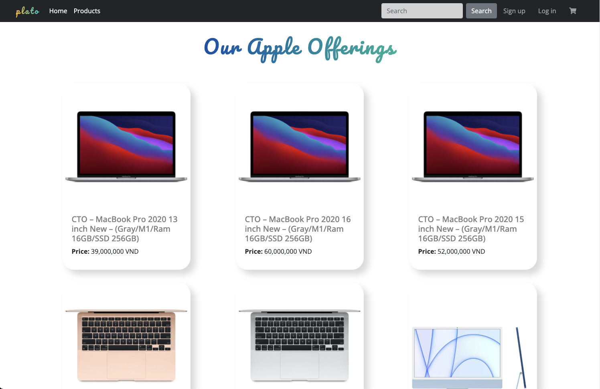
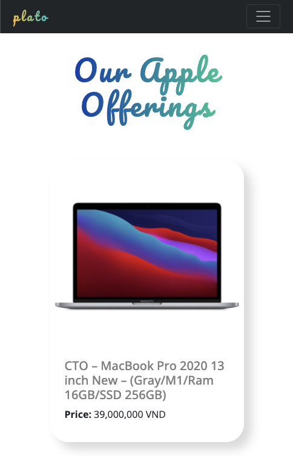
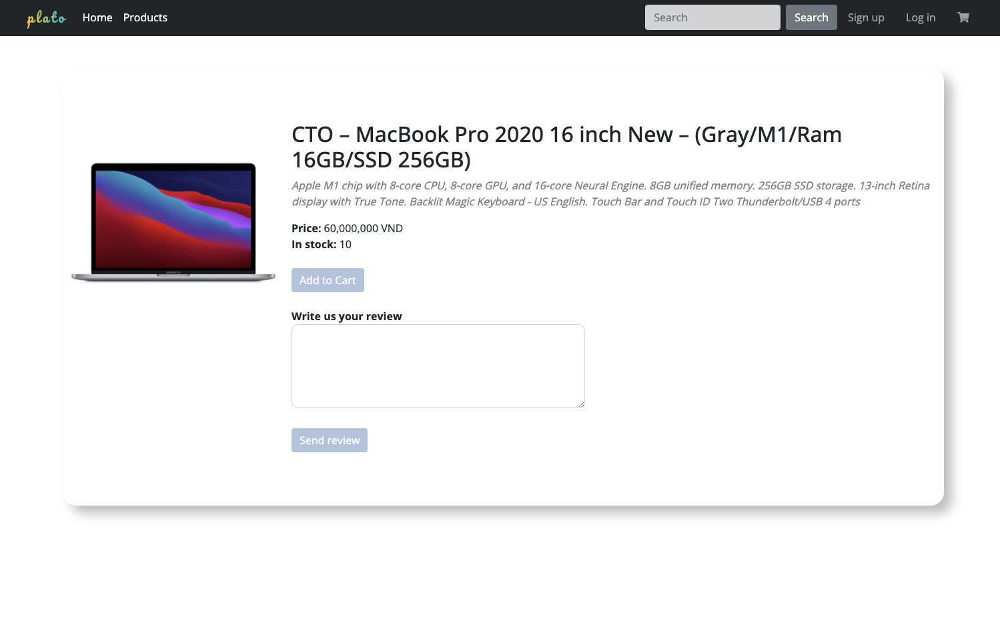
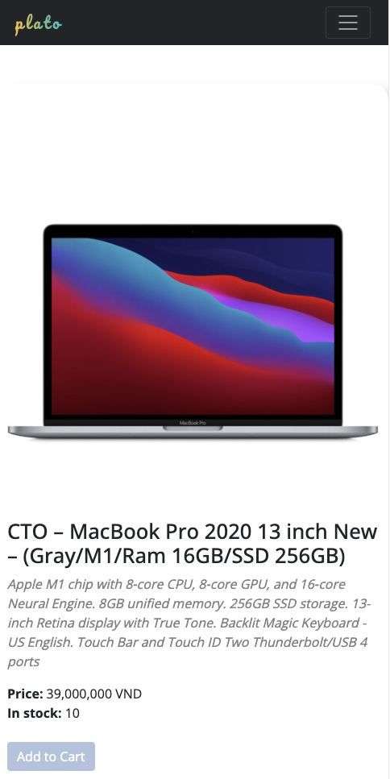
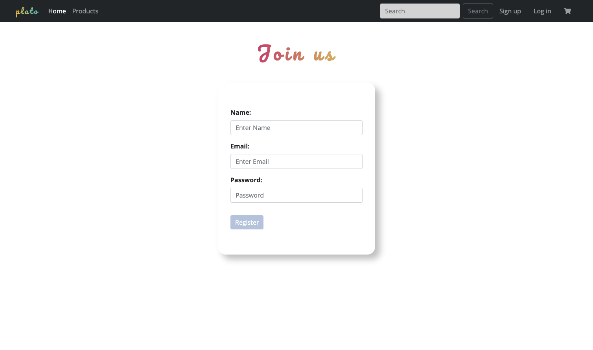
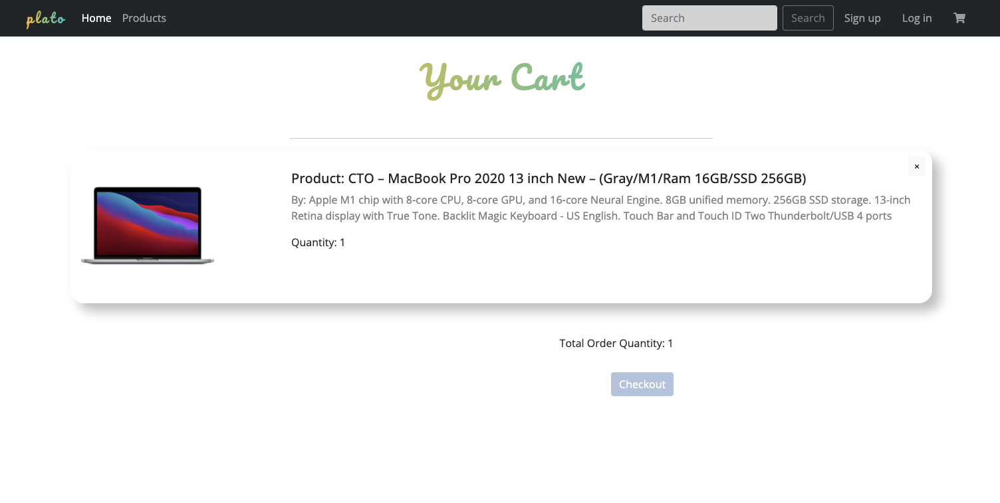

# E-commerce Website: Plato

> This project is to implement React JS and Redux to create an E-commerce website with API sponsored by CoderSchool, as this is a weekly project for Fullstack Web Development bootcamp at CoderSchool;

>
><strong>Abstract:</strong><em> "Plato" is a new e-commerce website, verified as an authorized reseller of Apple, retailing Apple products exclusively.</em>

## File Structure
```
|- plato-ecommerce-project/src
    |- components
        |- PaginationBar.js
        |- PublicNavbar.js
    |- pages
        |- CartPage
            |- CartPage.css
            |- CartPage.js
        |- DetailPage
            |- DetailPage.css
            |- DetailPage.js
            |- Youtube.js
        |- HomePage
            |- HomePage.css
            |- HomePage.js
        |- LoginPage
            |- LoginPage.css
            |- LoginPage.js
        |- ProductPage
            |- ProductPage.css
            |- ProductPage.js
        |- RegisterPage
            |- RegisterPage.css
            |- RegisterPage.js
    |- redux
        |- actions
            |- auth.action.js
            |- product.action.js
            |- user.action.js
        |- constant
            |- auth.constant.js
            |- product.constant.js
            |- user.constant.js
        |- reducers
            |- auth.reducer.js
            |- product.reducer.js
            |- user.reducer.js
            |- index.js
        |- store.js
    |- App.css
    |- App.js
    |- index.js
```

## UI Layout:
* HomePage Banner 

* Product Display Page


* Product Detail Page


* Register Page

* Cart Page


## Feature Overview:
- User are welcomed to the landing page with Apple's inspired aesthetic; 
- User can easily navigate to Product Page displaying the site's list of products; 
- User can navigate through the list of products with a pagination bar; 
- User can search for keyword related to product name, i.e. Macbook, iPad, etc;
- User can click each product card to the particular product page with more in-detail information of the product selected;
- User can use url to navigate to different sections of the site;
- User can register to make new account;
- User can login;
- Authorized User (who has signed up and logged in) can add product to cart;
- User can see cart detail;
- User can check out and order will be created;
- User with an authorized order can post a review with a validated order;

## Technologies:
Project is created with: 
* React JS
* Redux
* CSS
